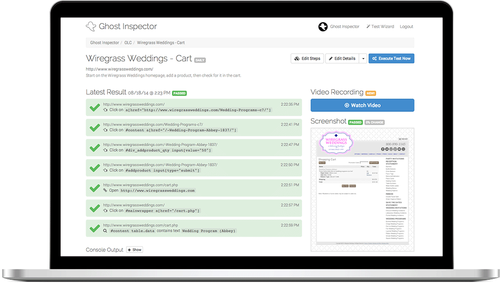
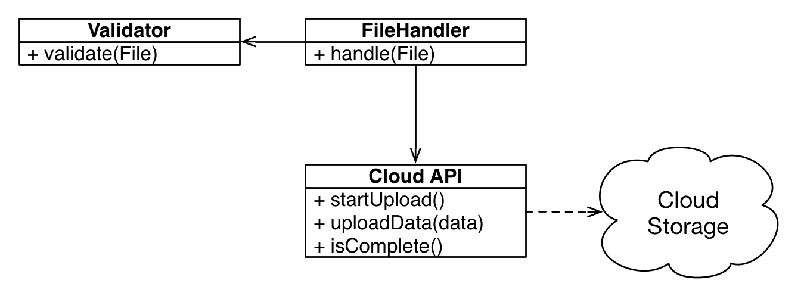
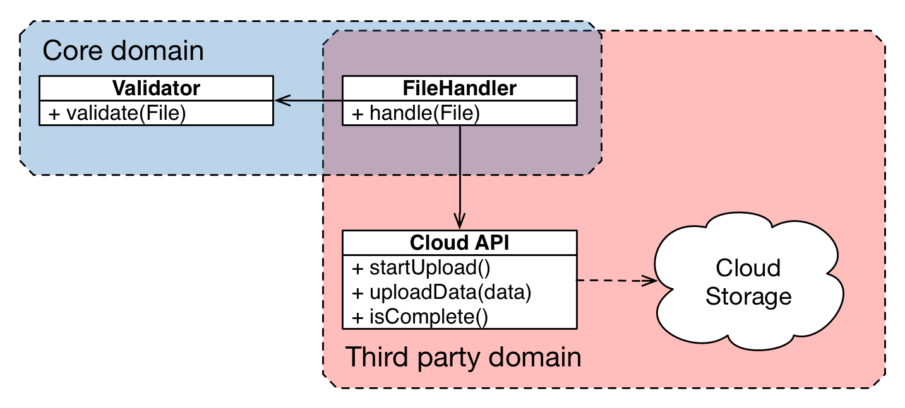
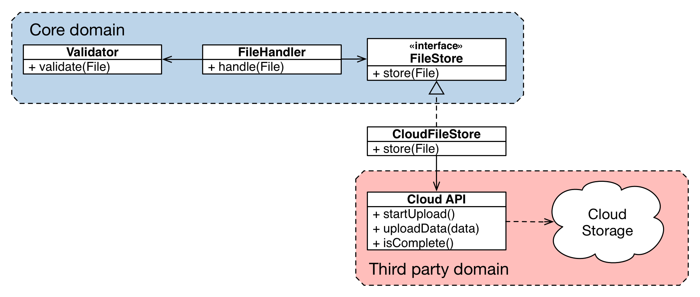
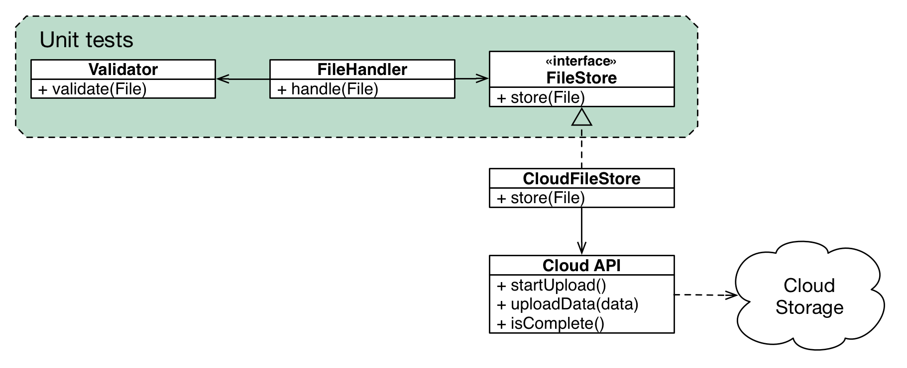
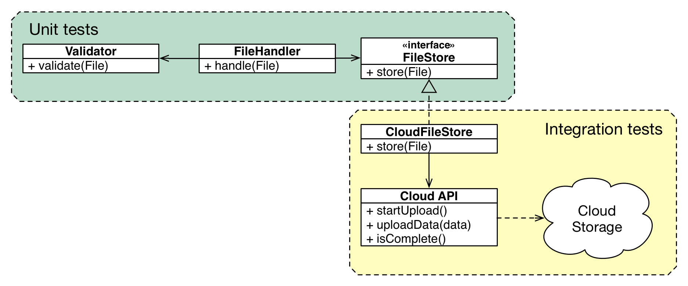
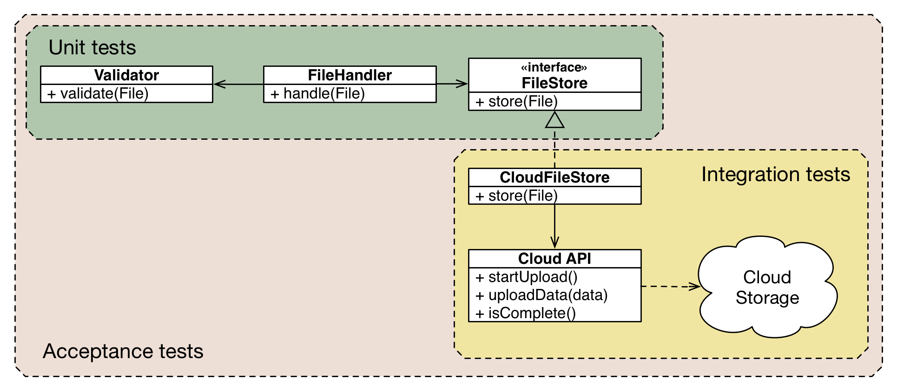

autoscale: true

# Building a Test Pyramid: Symfony testing strategies
## with Ciaran McNulty

---

## Before we start:
# You must test your applications!

^ Not interested in having this conversation!

---

# What kind of tests to use?

* Manual testing
* Acceptance testing
* Unit testing
* Integration testing
* End-to-end testing
* Black box / white box

---

# What tools to use?

* PHPUnit
* PhpSpec
* Behat
* Codeception
* BrowserKit / Webcrawler

^ Each tool tries to tell you it is the one solution

---

## Question:
# Why can't someone tell me which one to use?

---

## Answer:
# Because there is no best answer that fits all cases
# You have to find the tools that work for you

---

# Testing different layers
## Introducing the pyramid

- Defined by Mike Cohn in Succeeding with Agile
- For understanding different layers of testing

---


^ Mike Cohn, Succeeding with Agile

---

# UI layer tests

* Test the whole application end-to-end
* Sensitive to UI changes
* Aligned with acceptance criteria
* Does not require good code
* Probably slow

e.g. Open a browser, fill in the form and submit it


---

# Service layer tests

* Test the application logic by making service calls
* Faster than UI testing
* Aligned with acceptance criteria
* Mostly written in the target language
* Requires high-level services to exist

e.g. Instantiate the Calculator service and get it to add two numbers


---

# Unit level tests

* Test individual classes
* Much faster than service level testing
* Very fine level of detail
* Requires good design


---

# Why a pyramid?

* Each layer builds on the one below it
* Lower layers are faster to run
* Higher levels are slower and more brittle
* Have more tests at the bottom than at the top


---

# Why do you want tests?

## The answer will affect the type of tests you write

---

# If you want existing features from breaking
## ... write Regression Tests

---

# Regression tests 

* Check that behaviour hasn't changed
* Easiest to apply at the UI level
* ALL tests become regression tests eventually

---

# 'Legacy' code

```php
class BasketController extends Controller
{
    public function addAction(Request $request)
    {
        $productId = $request->attributes->get('product_id');
        $basket = $request->getSession()->get('basket_context')->getCurrent();

        $products = $basket->getProducts();
        $products[] = $productId;
				
        $basket->setProducts($products);

        return $this->render('::basket.html.twig', ['basket' => $basket]);
    }
}
```

---

# Regression testing with PHPUnit + BrowserKit

```php
class PostControllerTest extends WebTestCase
{
    public function testShowPost()
    {
        $client = static::createClient();

        $crawler = $client->request('GET', '/products/1234');
        $form = $crawler->selectButton('Add to basket')->form();

        $client->submit($form, ['id'=>1234]);

        $product = $crawler->filter('html:contains("Product: 1234")');

        $this->assertCount(1, $product);
    }
}
```

---

# Regression testing with Codeception

```php
$I = new AcceptanceTester($scenario);
$I->amOnPage('/products/1234');
$I->click('Add to basket');
$I->see('Product: 1234');
```

---

# Regression testing with Behat + MinkExtension

```gherkin
Scenario: Adding a product to the basket
  Given I am on "/product/1234"
  When I click "Add to Basket"
  Then I should see "Product: 1234"
```
---

# Regression testing with Ghost Inspector



---

# When regression testing

- Use a tool that gets you coverage quickly and easily
- Plan to phase out regression tests later
- Lean towards testing end-to-end
- Recognise they will be hard to maintain

---

# If you want to match customer requirements better
## ... write Acceptance Tests

---

# Acceptance Tests

* Check the system does what the customer wants
* Are aligned with customer language and intention
* Write them in English (or another language) first
* Can be tested at the UI or Service level

---

# Start with an example-led conversation
## ... before you start working on it
## ... but not too long before

---

* "What should the system do when X happens?"
* "Does Y always happen when X?"
* "What assumptions Z are causing Y to be the outcome?"
* "Given Z when X then Y"
* "What other things aside from Y might happen?"
* "What if...?"

---

# Write the examples out in business-readable tests
## Try and make the code look like the natural conversation you had

---

# Easiest to test through the User Interface

---

# UI Acceptance testing with PHPUnit + BrowserKit

```php
class PostControllerTest extends WebTestCase
{
    public function testAddingProductToTheBasket()
    {
       $this->addProductToBasket(1234);
       $this->productShouldBeShownInBasket(1234);
    }

    private function addProductToBasket($productId)
    {
        //... browser automation code
    }

    private function productShouldBeShownInBasket($productId)
    {
        //... browser automation code
    }
}
```

---

# UI Acceptance testing with Codeception

```php
$I = new AcceptanceTester($scenario);

$I->amGoingTo('Add a product to the basket');
$I->amOnPage('/products/1234');
$I->click('Add to basket');

$I->expectTo('see the product in the basket');
$I->see('Product: 1234');
```

---

# UI Acceptance testing with Behat + MinkExtension

```gherkin
Scenario: Adding a product to the basket
  When I add product 1234 to the basket
  Then I should see product 1234 in the basket
```

---

# UI Acceptance testing with Behat + MinkExtension

```php
/**
 * @When I add product :productId to the basket
 */
public function iAddProduct($productId)
{
    $this->visitUrl('/product/' . $productId);
    $this->getSession()->clickButton('Add to Basket');
}

/**
 * @Then I should see product :productId in the basket
 */
public function iShouldSeeProduct($productId)
{
    $this->assertSession()->elementContains('css', '#basket', 'Product: ' . $productId);
}
```

---

# Acceptance testing through the UI is slow and brittle
## To test at the service layer, we need to introduce services


---

# 'Legacy' code

```php
class BasketController extends Controller
{
    public function addAction(Request $request)
    {
        $productId = $request->attributes->get('product_id');
        $basket = $request->getSession()->get('basket_context')->getCurrent();

        $products = $basket->getProducts();
        $products[] = $productId;
				
        $basket->setProducts($products);

        return $this->render('::basket.html.twig', ['basket' => $basket]);
    }
}
```

---

# 'Service-oriented' code

```php
class BasketController extends Controller
{
    public function addAction(Request $request)
    {
        $basket = $this->get('basket_context')->getCurrent();
        $productId = $request->attributes->get('product_id');

        $basket->addProduct($productId);

        return $this->render('::basket.html.twig', ['basket' => $basket]);
    }
}
```
---

# A very small change
## but now the business logic is out of the controller

---

# Service layer Acceptance testing with PHPUnit

^ no longer reliant on the browser kit

```php
class PostControllerTest extends PHPUnit_Framework_TestCase
{
    public function testAddingProductToTheBasket()
    {
       $basket = new Basket(new BasketArrayStorage());
			 $basket->addProduct(1234);
       $this->assertContains(1234, $basket->getProducts());
    }
}
```

---

# Service layer acceptance testing with Behat + MinkExtension

```gherkin
Scenario: Adding a product to the basket
  When I add product 1234 to the basket
  Then I should see product 1234 in the basket
```

---

# Service layer acceptance testing with Behat

```php
/**
 * @When I add product :productId to the basket
 */
public function iAddProduct($productId)
{
    $this->basket = new Basket(new BasketArrayStorage());
    $this->basket->addProduct($productId);
}

/**
 * @Then I should see product :productId in the basket
 */
public function iShouldSeeProduct($productId)
{
    assert(in_array($productId, $this->basket->getProducts());
}
```

---

# When all of the acceptance tests are running against the Service layer
## ... how many also need to be run through the UI?

---

# Symfony is a controller for your app


---

# If you test everything through services
# ... you only need enough UI tests to be sure the UI is connected properly

---

# Multiple Behat suites

```gherkin
Scenario: Adding a product to the basket
  When I add product 1234 to the basket
  Then I should see product 1234 in the basket

Scenario: Adding a product that is already there
  Given I have already added product 1234 to the basket
  When I add product 1234 to the basket
  Then I should see 2 instances of product 1234 in the basket

@ui
Scenario: Adding two products to my basket
  Given I have already added product 4567 to the basket
  When I add product 1234 to the basket
  Then I should see product 4567 in the basket
  And I should also see product 1234 in the basket
```
---

# Multiple Behat suites

```
default:
    suites:
        ui:
            contexts: [ UiContext ]
            filters: { tags: @ui }
        service:
            contexts: [ ServiceContext ]
```

---

# If you want the design of your code to be better
## ... write Unit Tests
---


# Unit Tests

* Check that a class does what you expect
* Use a tool that makes it easy to test classes in isolation
* Move towards writing them first
* Unit tests force you to have good design
* Probably too small to reflect acceptance criteria

---

# Unit tests are too granular

Customer: "The engine needs to produce 500bhp"
Engineer: "What should the diameter of the main drive shaft be?"

---

# Unit testing in PHPUnit

```php
class BasketTest extends PHPUnit_Framework_Testcase
{
    public function testGetsProductsFromStorage()
    {
        $storage = $this->getMock('BasketStorage');
        $storage->expect($this->once())
                ->method('persistProducts')
                ->with([1234]);

        $basket = new Basket($storage);

        $basket->addProduct(1234);
    }
}

```

---

# Unit testing in PhpSpec


```php
class BasketSpec extends ObjectBehavior
{
    function it_gets_products_from_storage(BasketStorage $storage)
    {
        $this->beConstructedWith($storage);

        $this->addProduct(1234);

        $storage->persistProducts([1234])->shouldHaveBeenCalled([1234]);
    }
}

```

---

# Unit test
## ... code that is responsible for business logic
## ... not code that interacts with infrastructure *including Symfony*

---

# You *can* unit test interactions with Symfony (e.g. controllers)
## You shouldn't need to if you have acceptance tests

---

# Coupled architecture
  


---

# Unit testing third party dependencies

```php
class FileHandlerSpec extends ObjectBehaviour
{
    public function it_uploads_data_to_the_cloud_when_valid(
        CloudApi $client, FileValidator $validator, File $file
    )
    {
        $this->beConstructedWith($client, $validator);

        $validator->validate($file)->willReturn(true);

        $client->startUpload()->shouldBeCalled();
        $client->uploadData(Argument::any())->shouldBeCalled();
        $client->uploadSuccessful()->willReturn(true);

        $this->process($file)->shouldReturn(true);
    }
}
```

---

# Coupled architecture
  


---

# Layered architecture
  



---

# Testing layered architecture
  


---

```php
class FileHandlerSpec extends ObjectBehaviour
{
    public function it_uploads_data_to_the_cloud_when_valid(
        FileStore $filestore, FileValidator $validator, File $file
    )
    {
        $this->beConstructedWith($filestore, $validator);
        $validator->validate($file)->willReturn(true);

        $this->process($file);

        $filestore->store($file)->shouldHaveBeenCalled();
    }
}
```

---

# Testing layered architecture
  


---

```php
class CloudFilestoreTest extends PHPUnit_Framework_TestCase
{
    function testItStoresFiles()
    {
        $testCredentials = …
        $file = new File(…);

        $apiClient = new CloudApi($testCredentials);
        $filestore = new CloudFileStore($apiClient);

        $filestore->store($file);

        $this->assertTrue($apiClient->fileExists(…));
    }
}
```

---

# Testing layered architecture
  



---

# To build your pyramid...


----

# Have isolated unit-tested objects representing your core business logic 
## 10,000s of tests running in <10ms each


----

# Have acceptance tests at the service level
## 1,000s of tests running in <100ms each


---

# Have the bare minimum of acceptance tests at the UI level
## 10s of tests running in <10s each


---

# Thank You!

Any questions?

https://joind.in/talk/view/14972

@ciaranmcnulty
ciaran@sessiondigital.co.uk